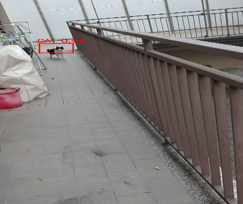

# Moving object detection using OpenCV (Emgu) and YOLO  

Download the pre-trained YOLO files at this [link](https://pjreddie.com/media/files/yolov3.weights)  
Sample video available [here](https://mega.nz/#!ICwUiYJI!GEAQ6DFciHeWw-lpxCVsqI96tQ6lddIzlJtx15jITSQ)  

Sample output:  

